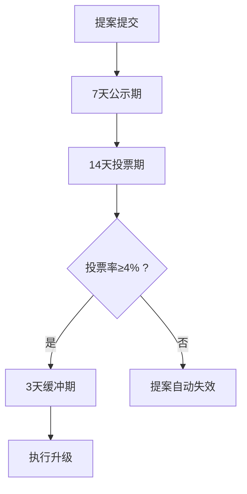

# LDO币有投资潜力吗？深度解析其价值与风险

## 核心价值定位
👉 [深入了解LDO币投资策略](https://bit.ly/okx_welcome)

LDO币作为流动性质押协议Lido的核心治理代币，其投资价值与以太坊生态发展、质押服务创新及去中心化治理机制深度关联。项目通过衍生代币机制解决传统质押流动性缺失问题，技术架构兼容多链环境，但生态扩展受制于节点服务质量与市场竞争格局。投资决策需综合评估协议安全性、治理代币效用及监管环境演变趋势。

## 投资潜力分析

### 质押市场基础支撑
流动性质押赛道的兴起为LDO币创造基础价值支撑：
- **刚性需求形成**：以太坊转向权益证明机制后，质押服务成为基础设施刚需
- **效率提升机制**：用户通过质押ETH获得等值流动代币，既保留验证收益又释放资产使用效率
- **跨链扩展能力**：当前协议已支持多条主流公链，形成差异化竞争优势

| 对比维度        | 传统质押       | Lido流动性质押   |
|-----------------|----------------|------------------|
| 资产流动性      | 完全锁定       | 可自由流通       |
| 收益获取周期    | 约32ETH起      | 无最低门槛       |
| 资产使用效率    | 单一用途       | 可参与DeFi生态   |

### 治理代币三重价值捕获
1. **服务费分成**：协议总收入的20%用于LDO代币回购销毁
2. **治理决策权**：持币者可参与协议升级、参数调整等重大决策
3. **流动性激励**：通过流动性池收益分配机制吸引长期持币

👉 [探索加密货币投资新机遇](https://bit.ly/okx_welcome)

### 技术架构优势
- **分层架构设计**：降低跨链交互成本，提升系统扩展性
- **多签安全机制**：采用多节点验证体系保障资产安全
- **动态费率模型**：根据市场供需自动调节质押服务费率

## 风险因素解析

### 市场波动风险
- **衍生品脱锚风险**：当ETH价格剧烈波动时，stETH与ETH的锚定关系可能受损
- **收益波动周期**：质押年化收益率在4%-8%区间浮动，受网络参与度影响显著
- **黑天鹅事件冲击**：极端市场环境下可能出现流动性危机

### 治理结构挑战
- **权力集中度**：前100个地址持有58.3%的代币供应量（据CoinGecko 2024Q2数据）
- **决策效率**：DAO治理流程平均耗时21天，紧急提案需72小时快速投票
- **技术门槛**：复杂提案的理解成本影响中小持币者参与度

## 行业趋势洞察

### 质押衍生代币双向锚定机制
流动性质押协议通过智能合约维持质押资产与衍生代币的价值锚定：
1. **超额抵押机制**：要求质押资产价值不低于衍生代币市值的110%
2. **自动清算系统**：当抵押率跌破阈值时触发强制平仓
3. **流动性激励池**：通过收益农场提升衍生代币交易深度

### 去中心化治理时间成本
DAO治理的提案生命周期：

👉 [获取专业加密资产配置方案](https://bit.ly/okx_welcome)

## FAQ常见问题

**Q：LDO币的总量是否有上限？**  
A：LDO代币采用通胀模型，初始发行量10亿枚，年通胀率约5%，通过回购销毁机制调节实际流通量。

**Q：如何参与Lido的治理决策？**  
A：需持有LDO代币并通过Snapshot平台参与投票，单个提案需获得至少4%的总投票权支持方能生效。

**Q：stETH与ETH脱锚风险如何管控？**  
A：协议设置1.1倍超额抵押率，当抵押率跌破阈值时触发自动平仓，同时设立保险基金应对极端行情。

**Q：Lido是否支持其他公链质押？**  
A：目前已支持Solana、Polkadot等11条公链，不同链的质押机制和收益结构存在差异，具体参数可通过官方文档查询。

**Q：LDO币适合长期持有还是短期交易？**  
A：建议采用"核心+卫星"配置策略：核心仓位长期持有，卫星仓位可结合市场波动进行波段操作，年化换手率控制在300%以内为宜。

## 投资决策建议

### 风险控制矩阵
| 风险等级 | 资产配置建议 | 对冲策略 |
|---------|-------------|---------|
| 低风险（≤10%） | 稳定币质押 | 期权对冲 |
| 中风险（10-30%） | ETH质押 | 跨链套利 |
| 高风险（≥30%） | 多链组合 | 衍生品对冲 |

### 长期价值观察指标
1. **TVL增长率**：月度增幅持续高于5%视为健康扩张
2. **节点分布度**：前10节点占比低于30%标志去中心化程度提升
3. **治理提案通过率**：稳定在65%-75%区间反映社区活力

投资者应建立动态监测体系，重点关注以太坊网络升级进度、全球监管政策变化及DeFi市场总锁仓量（TVL）变动趋势。在当前多链融合的发展阶段，LDO币的配置价值与其技术迭代速度正相关，建议采用定投策略平滑市场波动风险。