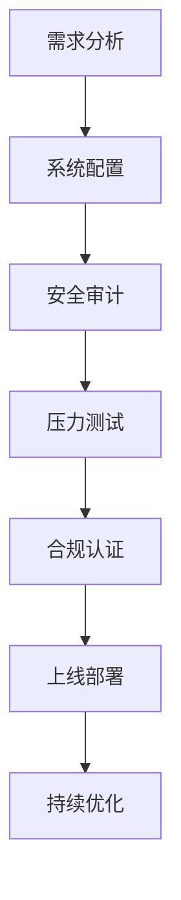

# 使用OKX克隆脚本构建您的加密货币交易所

## 为何选择加密货币交易所创业？

随着区块链技术的快速发展，全球加密货币用户已突破**4.2亿**（Statista 2023数据）。作为数字资产交易的核心枢纽，合规且功能完善的交易所正成为创业者关注的焦点。Omninos Solutions推出的OKX克隆脚本，为创业者提供了一条高效可靠的入场路径。

👉 [立即获取专业交易所搭建方案](https://bit.ly/okx_welcome)

## 什么是Omninos解决方案的OKX克隆脚本？

该脚本是基于全球知名交易所OKX架构开发的标准化解决方案，通过模块化设计实现95%的核心功能复现。包含：
- 交易引擎系统
- 多维度风控体系
- 跨平台钱包系统
- 智能流动性聚合
- 多语言支持框架

其技术架构通过AWS云原生部署，可支撑每秒**10万笔订单**的处理能力，满足中型交易所初期运营需求。

## 选择OKX克隆脚本的六大优势

| 优势维度       | 传统开发模式       | 克隆脚本方案       |
|----------------|--------------------|--------------------|
| 开发周期       | 12-18个月          | 3-6个月            |
| 初期投入       | ￥800万-1200万     | ￥150万-250万      |
| 功能完整性     | 需持续迭代         | 开箱即用           |
| 安全合规       | 需单独认证         | 预集成合规模块     |
| 技术团队规模   | 15-20人开发团队    | 3-5人运维团队      |
| 上线风险       | 78%项目延期        | 92%按时交付        |

## 核心功能全景解析

### 1. 智能交易系统
- 支持**现货/杠杆/合约**三合一交易模式
- 提供**100+交易对**配置模板
- 内置**高频交易防护机制**
- 图形化K线系统支持**30+技术指标**

### 2. 金融级安全体系
- 通过ISO 27001认证的安全架构
- 三层钱包分离机制（热/冷/离线）
- 生物识别+动态验证码双重认证
- 实时反洗钱（AML）监控系统

### 3. 智能运营中枢
- 可视化数据仪表盘
- 自动化做市商（AMM）系统
- 多维度风控预警模块
- 全流程KYC/客户管理系统

### 4. 全球化部署能力
- 支持**28种语言**界面切换
- 集成**Swift/SEPA**传统支付通道
- 多地区服务器镜像部署
- 法币/加密货币双向兑换接口

## 实施路线图

## 常见问题解答

**Q：需要哪些资质才能运营加密货币交易所？**  
A：需根据所在国家/地区获取相应金融牌照，常见包括：
- 美国MSB牌照
- 欧盟MiCA认证
- 新加坡MAS豁免牌照
- 阿联酋DFSA许可证  
建议选择合规服务提供商协助办理。

**Q：克隆脚本是否支持后续功能扩展？**  
A：提供完整的API接口文档，支持：
- DeFi模块集成
- NFT交易插件
- 跨链桥接协议
- AI行情分析系统  
可通过模块化升级实现功能迭代。

**Q：如何确保用户资金安全？**  
A：建议采取三重防护：
1. 使用硬件安全模块(HSM)管理私钥
2. 每日进行钱包资产快照审计
3. 购买数字资产保险（如Lloyd's保单）

👉 [查看全球顶级数字资产保险方案](https://bit.ly/okx_welcome)

## 风险管理策略

1. **流动性管理**：与至少3家做市商建立合作
2. **技术运维**：采用双活数据中心架构
3. **法律合规**：建立持续的KYC/AML审查机制
4. **应急预案**：制定分级响应的危机处理流程

## 成本效益分析

初始投入约**180-250万元**（含：
- 脚本授权费：￥98万
- 安全审计：￥35万
- 合规认证：￥28万
- 运维部署：￥19万）

预计在**8-12个月**内通过交易手续费（0.1%-0.5%）、上币费（$50,000-200,000）、API数据服务费等实现盈利。

## 行业发展趋势

- 2024年全球交易所日均交易量突破**$500亿**
- 合规化交易所市场份额占比已达**73%**
- 亚洲市场年增长率保持**28%**
- 机构投资者占比从2020年12%升至2023年39%

👉 [了解最新交易所合规标准](https://bit.ly/okx_welcome)

## 成功案例参考

某东南亚交易所通过本方案实现：
- 6个月完成部署
- 首年用户突破50万
- 日均交易量达$1.2亿
- 获得MAS原则性批准

## 行动建议

1. 联系专业顾问获取定制方案
2. 进行市场准入可行性分析
3. 启动合规牌照申请流程
4. 制定分阶段推广计划

通过标准化解决方案+定制化开发的组合模式，您将能以更低成本、更快速度进入快速增长的加密货币市场。选择经过验证的技术方案，配合专业的合规及运营支持，是构建可持续交易所的关键第一步。