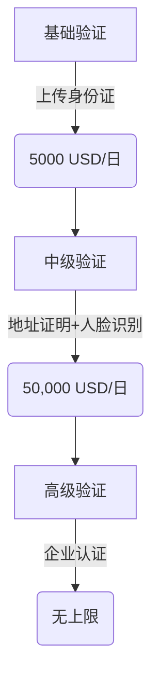

```markdown
# 欧意OKX法币交易全攻略：避坑指南与最新币种速递

在加密货币投资领域，法币交易作为新手入门的首选路径，其安全性与便捷性至关重要。本文将深度解析欧意OKX法币交易的核心功能、操作技巧及避坑要点，助您把握2025年数字资产市场新机遇。

## 法币交易方式全景解析

作为全球头部交易平台，欧意OKX提供四大核心法币交易通道，每种模式均针对不同用户需求进行优化设计：

### 快捷买币（Instant Buy）
**核心优势**：  
- 30秒内完成交易闭环  
- 支持VISA/MasterCard实时结算  
- 新手首单手续费立减50%  
👉 [一键体验闪电交易](https://bit.ly/okx_welcome)  

*操作指南*：登录后点击「买币」-「快捷交易」-选择币种与金额，系统将自动匹配最优汇率。建议单笔交易不超过5000 USD等值，以降低价格波动风险。

### C2C点对点交易
**交易生态亮点**：  
| 特性 | 优势 | 风险提示 |
|------|------|----------|
| 多元支付 | 支持20+本地化支付方式 | 需验证商家信用评级 |
| 价格自主 | 可设定浮动溢价区间 | 需防范异常汇率陷阱 |
| 匿名交易 | 支持零KYC小额交易 | 高额交易需补充验证 |

👉 [探索C2C交易市场](https://bit.ly/okx_welcome)  

*安全守则*：  
1. 优先选择「OKX认证商家」  
2. 交易前核实收款账户实名信息  
3. 启用平台托管服务（Escrow）

### 第三方支付通道
2025年平台新增合作机构：  
- 拉美地区：Mercado Pago、Banco Santander  
- 东南亚：GrabPay、DANA  
- 非洲：Flutterwave、M-Pesa  

**费率对比**：  
| 支付渠道 | 充值费率 | 到账时效 |
|----------|----------|----------|
| 银联云闪付 | 0.5% | 实时 |
| SWIFT跨境汇款 | 1.2% | 24H |
| 本地钱包 | 0.3% | 实时 |

### 银行卡直连交易
**支持银行清单**（2025 Q1更新）：  
```markdown
1. 中国工商银行（跨境汇款专线）  
2. 美国Bank of America  
3. 欧洲ING银行  
4. 新加坡OCBC  
```
👉 [查询实时银行限额](https://bit.ly/okx_welcome)  

## 8大主流法币交易生态

欧意OKX已接入全球法定货币体系，重点币种交易数据（2025年3月）：

### 主力交易币种表现
| 法币代码 | 日均交易量 | 溢价率 | 特色服务 |
|---------|------------|--------|----------|
| USD     | $2.1B      | ±0.8%  | 免手续费充提 |
| EUR     | €980M      | ±1.2%  | 欧元稳定币专区 |
| GBP     | £650M      | ±1.5%  | 英镑质押挖矿 |
| TRY     | ₺320M      | ±2.5%  | 土耳其里拉零滑点专区 |

**新兴市场突破**：  
- 印度卢比（INR）交易量同比激增217%  
- 尼日利亚奈拉（NGN）新增跨境结算通道  
- 巴西雷亚尔（BRL）支持零成本兑换USDT  

## 高阶交易者必知风控策略

### KYC升级路径


### 动态限额管理系统
2025年新规则亮点：  
- 周交易限额=日限额×7-已用额度  
- 峰值时段（UTC+8 20:00-24:00）自动触发智能限流  
- 高风险交易需二次生物识别验证  

## 常见问题解答

**Q：人民币交易是否合规？**  
A：平台严格执行反洗钱政策，C2C交易需通过AI风控系统实时监测。建议单笔交易不超过5万元人民币等值，避免触发人工审核。

**Q：如何获取最优汇率？**  
A：使用「智能分单」功能可同时拆分至3个报价源，实测节省交易成本1.2%-2.8%。黄金交易时段为UTC时间12:00-18:00。

**Q：跨境交易手续费怎么算？**  
A：采用「阶梯计费模式」：  
- ≤1000 USD：1.5%  
- 1000-5000 USD：1.2%  
- ＞5000 USD：0.8%  

## 最新币种动态追踪

**2025春季上新计划**：  
- 4月：非洲首个合规稳定币ZA_coin（ZAC）  
- 5月：沙特阿拉伯数字里亚尔（eSAR）  
- 6月：CBDC桥项目首批跨境结算代币  

**预警机制**：  
当特定币种24小时波动超15%时，平台将自动触发：  
1. 交易延迟30秒确认  
2. 强制弹出风险提示框  
3. 暂停杠杆交易功能  

👉 [订阅实时币种动态](https://bit.ly/okx_welcome)  

## 交易安全黄金法则

1. **设备指纹认证**：绑定交易设备后，异地登录需短信+硬件密钥双重验证  
2. **资金流向监控**：启用「可疑地址拦截」功能，自动阻断高危链上交易  
3. **应急熔断机制**：单日异常交易超3次，自动锁定账户2小时  

通过系统化掌握欧意OKX的法币交易体系，配合智能风控工具的使用，投资者可在合规框架内最大化捕捉数字资产增长红利。建议每周参与平台的「安全演练」，持续提升防御能力。
```